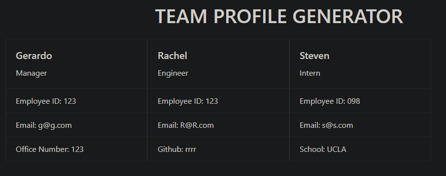

# Team-Profile Generator
This Team-Profile Generator was created to provide teams with a way to easily generate a list of their members that includes relavant data for each member. 

This makes it possible for teams to save time that would have been spent creating a profile, and spend more time working on their projects. 

This project was a valuable learning experience in OOP, and Jest unit-testing. 

## Installation
In order to install download all the relevant files. 

## Usage
To run the application run index.js file inside Node.js terminal. 

To generate a team-profile, answer the questions that appear in the terminal. Once you're finished the application will generate a team-profile in html form. 

Please follow the video link below for a walkthrough description 
https://watch.screencastify.com/v/FiJy95ffHJXbcuYmRt1B

## License
MIT

## Tests
Jest unit-tests are provided in the __tests__ folder 
